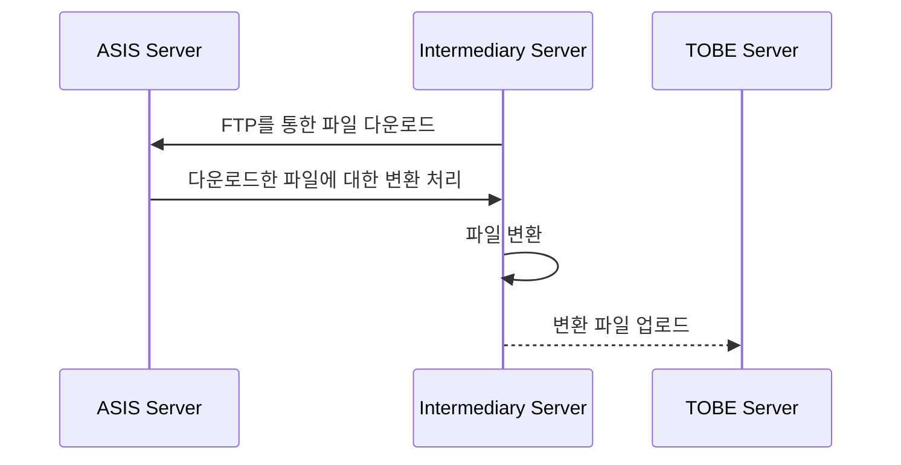
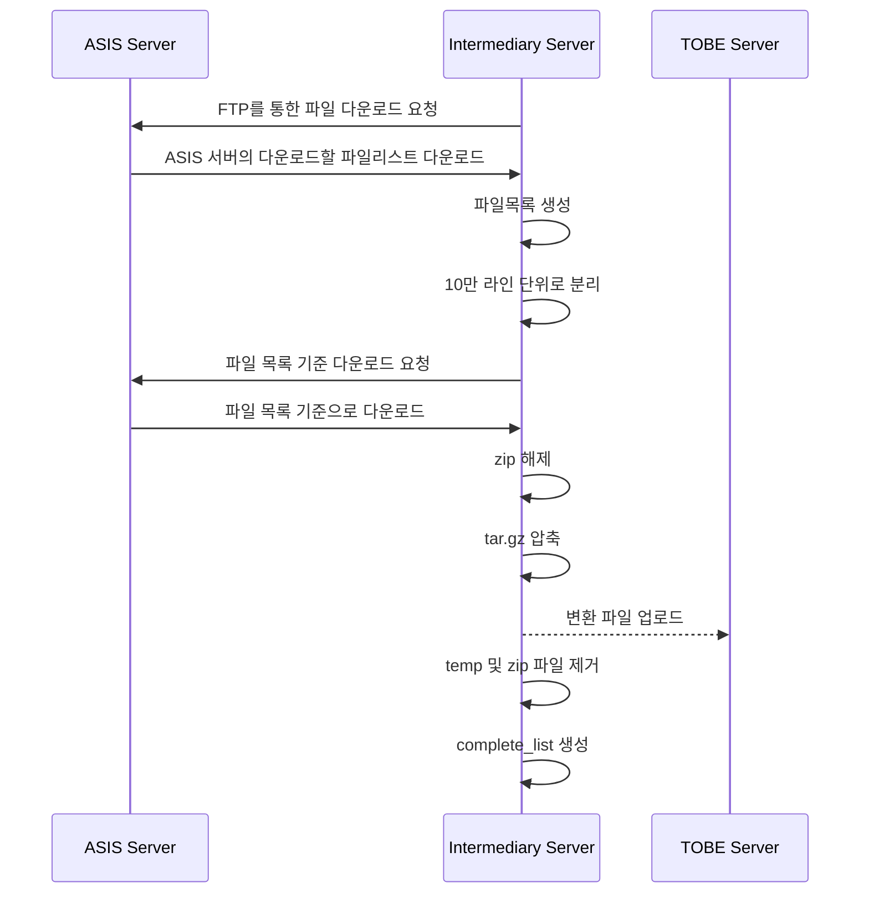

# FTP 간의 파일 마이그레이션 프로젝트 

최근에 어떤 프로젝트에서 쉘 스크립트를 작성해야할 상황이 생겼습니다. 아시는 분을 통해서 받게된 프로젝트라서 잘 정리를 하고 싶은 마음이었습니다.   

옮겨야할 파일 사이즈는 약 50TB 정도 되었습니다. 

서버의 구성은 아래와 같았고, 외부에서의 접속은 불가능한 환경이었고, 순수 쉘로만 동작하는 코드를 작성해야 했습니다. 



기본적인 서버 환경을 세팅하고, FTP 서버 접속을 위한 기본 구성 작업을 했습니다. 

각 서버 간의 FTP 설정이 되어 있지 않아서 vsftpd를 이용해서 설치를 진행했습니다. 

```shell 
sudo apt-get install vsftpd
```

이후 아래의 처리절차에 따라서 Shell Script를 작성해봤어요. 



각 파일 목록을 다운로드 받은 이후에 10만 라인 단위로 파일을 분리하여 백그라운드로 쉘을 돌렸습니다. 

아래는 실제 돌려본 스크립트입니다. 

해당 스크립트를 파일 목록 단위로 백그라운드에서 돌렸고, 하루에 약 4TB 정도의 데이터 처리를 확인했습니다. 
여기서 중요한 부분은 변환 서버의 스펙도 적절하게 구성되어야 합니다. 

```shell 
#!/bin/bash

print_usage()
{
  echo "Usage: TARGET_FILE_LIST is missing"
  exit 2
}

# FTP 서버 정보
SOURCE_FTP_SERVER="***.***.***.***"
SOURCE_FTP_USERNAME="****"
SOURCE_FTP_PASSWORD="****"
LOCAL_DIR="/files/workspace/$1"
DESTINATION_FTP_SERVER="***.***.***.***"
DESTINATION_FTP_USERNAME="****"
DESTINATION_FTP_PASSWORD="****"
ERROR_LOG="error_log.txt"
COMPLETE_LIST="complete_list.txt"
ERROR_LIST="error_list.txt"

if [ -n "$2" ]; then 
  TARGET_FILE_LIST="$LOCAL_DIR/$2"
else    
  print_usage
fi


# 다운로드 및 변환 작업을 위한 임시 디렉토리
TEMP_DIR="$LOCAL_DIR/temp"
mkdir -p "$TEMP_DIR"

function error_handler {
  local line=$1 
  local file=$2 
  echo "Error occurred at line $line while processing $file" >> $ERROR_LOG 
}

function file_download {
  ftp -inv $1 <<EOF
user $2 $3
binary 
cd $4
get $5
bye
EOF
}

function file_upload {
  ftp -inv $1 <<EOF
user $2 $3
binary
cd $5
mput $6
bye
EOF
}

function ftp_mkdir_p {
  local dir_path=$1
  local IFS="/"
  read -ra ADDR <<< "$dir_path"
  local current_path="/files"

  for part in "${ADDR[@]}"; do 
    current_path="$current_path/$part"
    ftp -inv $DESTINATION_FTP_SERVER <<EOF
user $DESTINATION_FTP_USERNAME $DESTINATION_FTP_PASSWORD
binary 
mkdir $current_path
bye 
EOF

  done
}

while IFS= read -r FILE_NAME; do 
  filename=$(basename "$FILE_NAME")
  dirname=$(dirname "$FILE_NAME")   

  file_download $SOURCE_FTP_SERVER $SOURCE_FTP_USERNAME $SOURCE_FTP_PASSWORD $dirname $filename

  # ZIP 파일을 tar.gz로 변환
  if [[ "$FILE_NAME" == *.zip* ]]; then
      # 파일 이름에서 확장자 제거
      filename=$(basename "$FILE_NAME" .zip)
      dirname=$(dirname "$FILE_NAME")

      # ZIP 파일을 임시 디렉토리로 이동 후 압축 해제
      unzip "$filename.zip" -d "$TEMP_DIR/$filename" || {
        error_handler $LINENO $FILE_NAME
        echo "$FILE_NAME" > $ERROR_LIST
        #return 
      }

      # tar.gz로 압축
      tar -zcvf "$filename.tar.gz" -C "$TEMP_DIR" "$filename" || {
        error_handler $LINENO $FILE_NAME
        echo "$FILE_NAME" > $ERROR_LIST
        #return
      }

      sed -i "s^$FILE_NAME^^" $TARGET_FILE_LIST
      sed -i "/^$/d" $TARGET_FILE_LIST

      echo "$FILE_NAME" >> "$LOCAL_DIR/$COMPLETE_LIST"

      filtered_dir_name=$(echo -e "$dirname" | sed "s@/files@@")

      ftp_mkdir_p $filtered_dir_name

      file_upload $DESTINATION_FTP_SERVER $DESTINATION_FTP_USERNAME $DESTINATION_FTP_PASSWORD $filtered_dir_name $dirname "$filename.tar.gz"

      echo "파일 다운로드 완료 $FILE_NAME 이 다운로드 되었음: $filtered_dir_name , $TEMP_DIR, $filename"

      # 임시 디렉토리 정리
      find "temp/$filename" -type f -exec rm -f {} \;
      find "temp/$filename" -type d -empty -delete
      
      [ -f $filename.zip ] && rm $filename.zip
      [ -f $filename.tar.gz ] && rm $filename.tar.gz
  else
      # FTP 서버로 일반 파일 업로드
      #filename=$(basename "$FILE_NAME")
      #dirname=$(dirname "$FILE_NAME")

      sed -i "s^$FILE_NAME^^" $TARGET_FILE_LIST
      sed -i "/^$/d" $TARGET_FILE_LIST

      filtered_dir_name=$(echo -e "$dirname" | sed "s^/files^^")

      ftp_mkdir_p $filtered_dir_name

      file_upload $DESTINATION_FTP_SERVER $DESTINATION_FTP_USERNAME $DESTINATION_FTP_PASSWORD $filtered_dir_name $dirname $filename

      echo "$FILE_NAME" >> "$LOCAL_DIR/$COMPLETE_LIST"

      echo "파일 다운로드 완료 $FILE_NAME 이 다운로드 되었음: $filtered_dir_name , $TEMP_DIR, $filename"

      rm $filename 
  fi 
done<"$TARGET_FILE_LIST"
```

# 실행 후 이슈 및 경험담

## 파일을 다운로드 받기 위해서 FTP 접속시 binary 모드로 설정해서 처리했어야 했다. 

 처음에는 아래 코드에서 binary를 빼고 다운로드 받았더니, 파일 업로드 후 압축해제시 파일이 깨지는 이슈가 발생하였습니다. 

```shell 
  ftp -inv $1 <<EOF
user $2 $3
binary 
cd $4
get $5
bye
EOF
```

여기에서 아스키모드와 바이너리 모드에 대해서 알아보니, 

- ASCII 
  - ANSI가 규정한 것으로, 컴퓨터에서 문자를 읽고 쓰기 위한 표준 방식, 영어 알파벳과 외국어 문자, 숫자, 구두점과 선택된 기호 등의 256 등의 글자를 8비트 코드로 정의하고 있습니다. 
- Binary 
  - 2진수, 2진법 : 0과 1의 두 숫자만으로 수를 나타내는 표기방법, 2를 기반으로 하는 숫자 체계로 컴퓨터에서 데이터를 표현하기 위해 사용됩니다. 

바이너리나 아스키나 데이터 정보에는 차이는 없습니다. 다만 전송 과정에서 아스키 방식으로 보내게 되면 각 데이터가 아스키 문자로 인식됩니다. 이 문자 중 일부는 윈도우와 유닉스 방식이 서로 다릅니다.  
특이 행이 바뀜을 알리는 문자가 그렇습니다. 행이 바뀌는 곳 마다 행이 끝남을 알리는 문자가 되는 것으로 알고 있습니다. 

따라서 텍스트 문서가 아닌 모든 데이터는 아스키 방식으로 전송할 경우 위에서 말한 문자 정보가 포함되어 결국 데이터가 엉망이 됩니다.
따라서 ftp 접속시 binary 모드로 지정해서 사용합니다. 

```shell 
ftp>
ftp> binary 
200 Switching to Binary mode.
ftp>
```

## 파일업로드와 대역폭의 상관 관계 

### 업로드 품질에 영향을 미치는 요소 

- 네트워크 대역폭 
- 사용자와 스토리지 센터 사이의 거리 
- 약한 네트워크 

대역폭은 주파스의 범위를 뜻한다. 따라서 데이터를 전송할 때는 정보를 전송하기 위한 채널이 얼마만큼의 정보 전송을 가지고 있는지를 나타낸다. 
일반적으로는 대역폭의 크기는 전송속도와 비례 한다.   

하지만 변조 방식에 따라서 더많은 데이터를 전송할 수 있다면 더욱 효율성이 좋을 수 있다는 것.   
따라서 다양한 방법과 변조 방식을 사용하게되면 좋은 대역폭이라도 높은 전송속도를 가질수 있음. 

> [FTP(File Transfer Protocol)](https://leeeeye321.tistory.com/131)
> [파일 전송 프로토콜(VSFTP)](https://blog.naver.com/rufgksdb/221472925952)

## Shell 스크립트를 짜는 것은 처음이었지만, 역시 그냥 하면 된다.  

해당 스크립트를 작성하면서 Shell의 다양한 종류와 각 구성 방법에 대해서도 이해볼 수 있어서 도움이 되었습니다.   

주로 내가 다뤘던건 응용 소프트웨어 어플리케이션과 연관된 인프라를 다뤄본 경험은 있지만 순수하게 쉘로 스크립트를 짜게 될 줄은 몰랐습니다. 
역시 처음 해보는 것은 약간의 스트레스가 동반하지만 일 자체는 재미있었습니다. 사실 어떤 일이든 그냥 다양하게 해보고 싶은 마음을 가지고 있고, 기본적인 개념을 가지고 있으면 어떻게든 할 수 있겠다 싶어 어떤 일이든 도전해볼 생각인데,   
어떻게든 노력하고 준비하면 결과는 만들어지고 그 과정 속에서 발생하는 일들은 나의 성장에 도움이 된다고 생각하기에, 유익한 프로젝트였다고 생각하는 중입니다. 